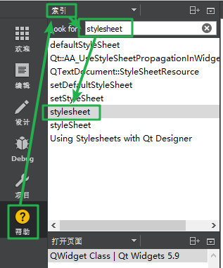
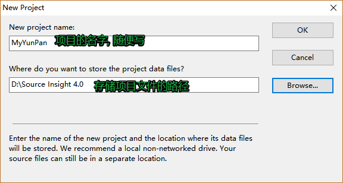
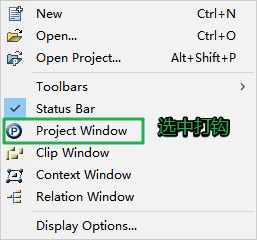
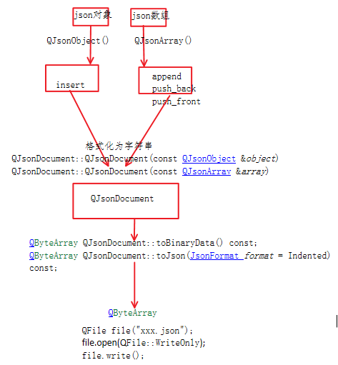

## 1. 登录和注册协议

### 1.1 注册协议

1. 客户端

   ```http
   # URL
   http://192.168.1.100:80/reg
   # post数据格式
   {
   	userName:xxxx,
       nickName:xxx,
       firstPwd:xxx,
       phone:xxx,
       email:xxx
   }
   ```

2. 服务器端 - Nginx

   - 服务器端的配置

     ```nginx
     location /reg
     {
         # 转发数据
         fastcgi_pass localhost:10000;
         include fastcgi.conf;
     }
     ```

   - 编写fastcgi程序

     ```c
     int main()
     {
         while(FCGI_Accept() >= 0)
         {
             // 1. 根据content-length得到post数据块的长度
             // 2. 根据长度将post数据块读到内存
             // 3. 解析json对象, 得到用户名, 密码, 昵称, 邮箱, 手机号
             // 4. 连接数据库 - mysql, oracle
             // 5. 查询, 看有没有用户名, 昵称冲突 -> {"code":"003"}
             // 6. 有冲突 - 注册失败, 通知客户端
             // 7. 没有冲突 - 用户数据插入到数据库中
             // 8. 成功-> 通知客户端 -> {"code":"002"}
             // 9. 通知客户端回传的字符串的格式
             printf("content-type: application/json\r\n");
             printf("{\"code\":\"002\"}");
         }
     }
     ```

   - 服务器回复的数据格式:

     | 成功         | {"code":"002"} |
     | ------------ | -------------- |
     | 该用户已存在 | {"code":"003"} |
     | 失败         | {"code":"004"} |

### 1.2 登录协议

1. 客户端

   ```http
   #URL
   http://127.0.0.1:80/login
   # post数据格式
   {
       user:xxxx,
       pwd:xxx
   }
   ```

2. 服务器端

   - Nginx服务器配置

     ```nginx
     location /login
     {
         # 转发数据
         fastcgi_pass localhost:10001;
         include fastcgi.conf;
     }
     ```

   - 服务器回复数据格式

     ```json
     // 成功
     {
         "code": "000",
         "token": "xxx"
     }
     // 失败
     {
         "code": "001",
         "token": "faild"
     }
     ```

## 2. 单例模式

1. 单例模式的优点: 

   - 在内存中只有一个对象, 节省内存空间 
   - 避免频繁的创建销毁对象,可以提高性能 
   - 避免对共享资源的多重占用 
   - 可以全局访问 

2. 单例模式的适用场景: 

   - 需要频繁实例化然后销毁的对象 

   - 创建对象耗时过多或者耗资源过多,但又经常用到的对象 

     ```c++
     struct More
     {
         int number;
         ...(100)
     }
     ```

   - 有状态的工具类对象 

   - 频繁访问数据库或文件的对象 

   - 要求只有一个对象的场景  

3. 如何保证单例对象只有一个?

   ```c
   // 在类外部不允许进行new操作
   class Test
   {
   public:
   	// 1. 默认构造
   	// 2. 默认析构
   	// 3. 默认的拷贝构造
   }
   // 1. 构造函数私有化
   // 2. 拷贝构造私有化
   ```

4. 单例模式实现方式?

   - 懒汉模式 - 单例对象在使用的时候被创建出来, 线程安全问题需要考虑

     ```c++
     class Test
     {
     public:
     	static Test* getInstance()
     	{
     		if(m_test == NULL)
             {
          		m_test = new Test();       
             }
             return m_test;
     	}
     private:
     	Test();
     	Test(const Test& t);
     	// 静态变量使用之前必须初始化
     	static Test* m_test;
     }
     Test* Test::m_test = NULL;	// 初始化
     ```

   - 饿汉模式 - 单例对象在使用之前被创建出来

     ```c++
     class Test
     {
     public:
     	static Test* getInstance()
     	{
     		return m_test;
     	}
     private:
     	Test();
     	Test(const Test& t);
     	// 静态变量使用之前必须初始化
     	static Test* m_test;
     }
     Test* Test::m_test = new Test();	// 初始化
     ```


1. QRegExp类

   ```c++
   QRegExp::QRegExp();
   QRegExp::QRegExp(const QString &pattern, Qt::CaseSensitivity cs = Qt::CaseSensitive, PatternSyntax syntax = RegExp)
       - pattern: 正则表达式, 该对象继续数据校验的规则
   bool QRegExp::exactMatch(const QString &str) const
       - str: 被校验的字符串
       - 返回值: 匹配成功: true, 失败:false
   // 重新给正则对象指定匹配规则
   void QRegExp::setPattern(const QString &pattern)
       - pattern: 正则表达式
   ```

2. 鼠标拖动窗口移动, 左上角坐标求解方法:

   

   > 1. 在鼠标按下还没有移动的时候求差值
   >
   >    差值 = 鼠标当前位置 - 屏幕左上角的点
   >
   > 2. 鼠标移动过程中
   >
   >     屏幕左上角的点 = 鼠标当前位置 - 差值

3. QSS参考资料

   - <https://blog.csdn.net/liang19890820/article/details/51691212

4. 通过样式函数给控件设置样式

   ```c++
   void setStyleSheet(const QString &styleSheet)
   	- 参数styleSheet: 样式字符串, css格式
   	- 在QT中参照帮助文档也可以
   ```

   

5. sourceInsight

   

   

   

   


```c
// 刷新窗口
// 什么时候被回调?
// 1. 窗口第一次现实的时候
// 2. 窗口被覆盖, 又重新显示
// 3. 最大化, 最小化
// 4. 手动重绘 - > 调用一个api : [slot] void QWidget::update()
// 函数内部写的绘图动作 -> QPainter
[virtual protected] void QWidget::paintEvent(QPaintEvent *event);
	- QPainter(QPaintDevice *device) -> 参数应该this

// 这个点是窗口左上角坐标
void move(int x, int y);
void move(const QPoint &);

```

Qt中使用正则表达式进行数据校验:

```c++
// 使用的类: QRegExp
// 1. 构造对象
QRegExp::QRegExp();
QRegExp::QRegExp(const QString &pattern, Qt::CaseSensitivity cs = Qt::CaseSensitive, PatternSyntax syntax = RegExp);
	- pattern: 正则表达式
// 2. 如何使用正则对象进行数据校验
bool QRegExp::exactMatch(const QString &str) const;
	- 参数str: 要校验的字符串
	- 返回值: 匹配成功: true, 失败: false
// 3. 给正则对象指定匹配规则或者更换匹配规则
void QRegExp::setPattern(const QString &pattern);
	- 参数pattern: 新的正则表达式
```

Qt中处理json

```c++
// QJsonDocument
// 1. 将字符串-> json对象/数组; 2. json对象,数组 -> 格式化为字符串
// QJsonObject -> 处理json对象的   {}
// QJsonArray  -> 处理json数组		[]
// QJsonValue  -> 包装数据的, 字符串, 布尔, 整形, 浮点型, json对象, json数组
```

1. 内存中的json数据 -> 写磁盘

   

2. 磁盘中的json字符串 -> 内存

   


